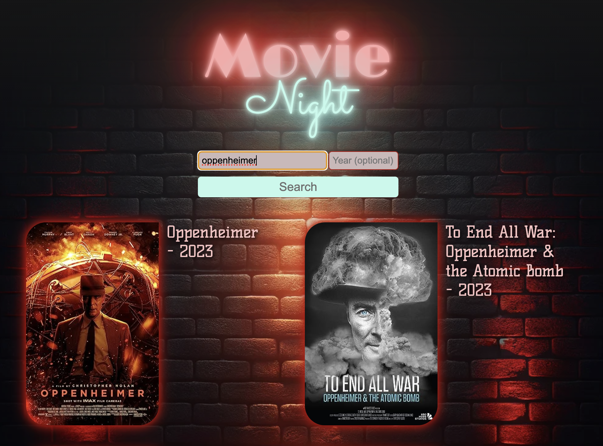
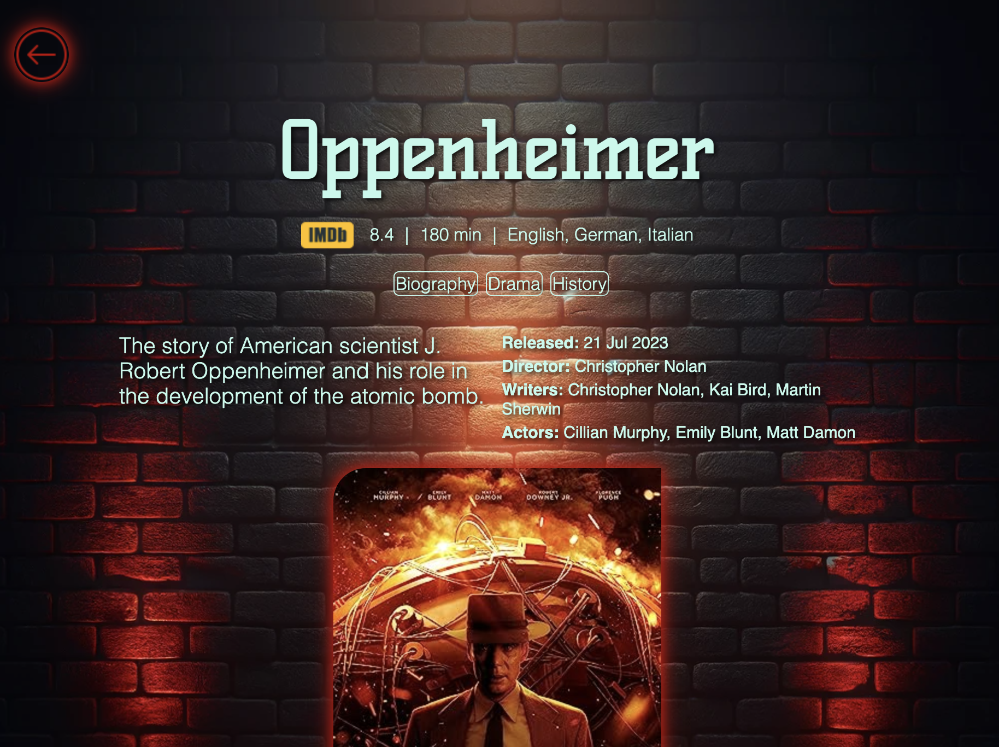

# Project title

Movie Night

# Live Demo Link

https://resonant-arithmetic-f0da23.netlify.app/

# About

Welcome to my movie app-project were you can search for movies forr your movienight.
You search with a movie title and to get a mor exact search you can input year of the film.
By clicking on a movie you come to a detail page about this movie and you can easily navigate back with the back arrow.

# Technologies

For this project, I have used:

- JavaScript ES6+
- React: Hooks such as `useState` and `useEffect` for state management and side effects.
- React Router: Utilizing hooks like `useNavigate` and `useParams`, and the `Link` component for SPA routing.
- CSS: For styling components and layouts.
- OMDb API: To fetch movie data.
- Environmental Variables: To securely manage API keys and other sensitive information.
- Session Storage: For persisting state across browser sessions.

# Screenshots

